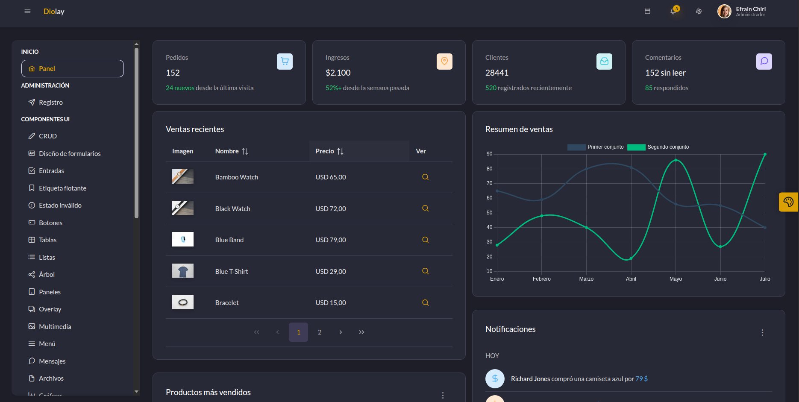
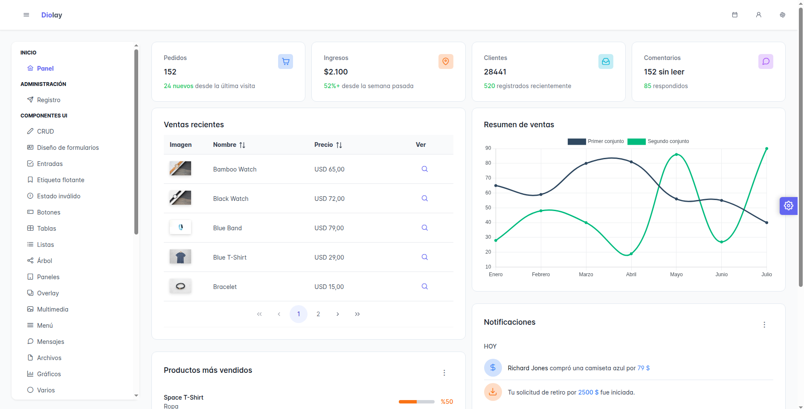
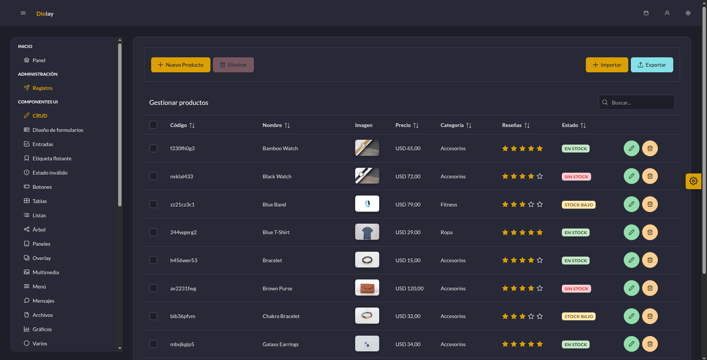
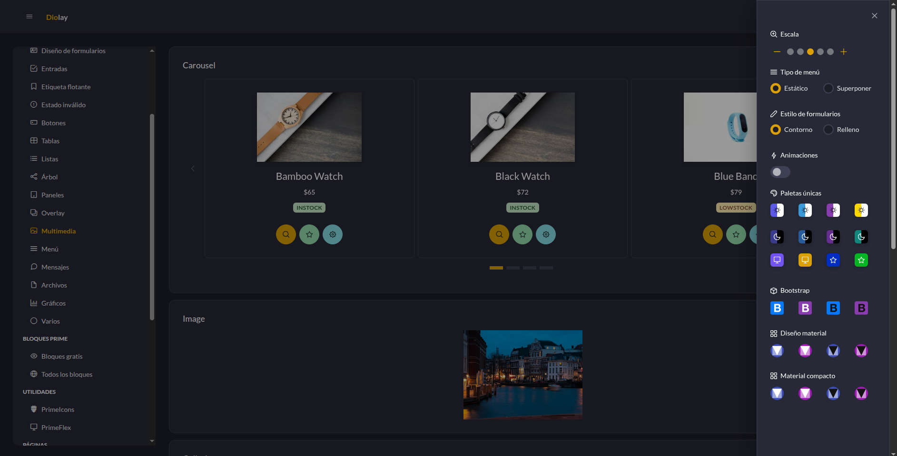

<div align="center">


</div>


##  Instalación y ejecución

<p align="center">
  <b> Sigue estos pasos para iniciar el proyecto</b>
</p>

```bash
# ▶ Instalar dependencias
npm install

# ▶ Ejecutar en desarrollo
npm run dev
```
<div align="center">
  
    
  
  

</div>
